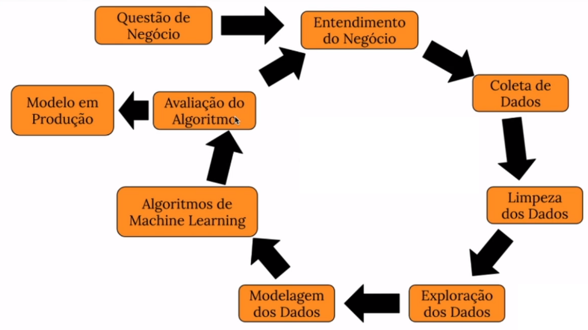
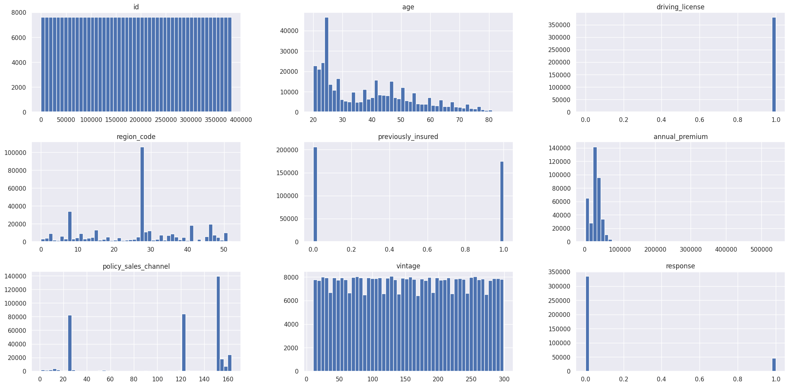

# Previsão de Propensão para Seguro de Automóvel (Cross-Sell)

# 1. Contexto do Projeto

Este repositório documenta um projeto completo de Ciência de Dados, do problema de negócio até o modelo em produção, cujo foco é um modelo de classificação/ranqueamento. A empresa fictícia deste estudo já vende planos de saúde e agora avalia lançar um segundo produto para sua base: seguro de automóvel. A pergunta central é simples de enunciar e difícil de responder bem: **dado o histórico de clientes que já foram consultados sobre o novo seguro, quem entre os clientes ainda não consultados tem maior chance de dizer "sim"?**

O valor de negócio por trás dessa pergunta está na priorização. Em vez de a equipe comercial ligar para toda a base em ordem aleatória (ou por critérios simples como idade ou tempo de casa), o modelo entrega uma lista ordenada por propensão de compra — permitindo concentrar esforço (e custo de ligação) em quem realmente tem chance de converter.

Este projeto foi construído como parte dos meus estudos práticos de Ciência de Dados, seguindo um ciclo completo de desenvolvimento — da exploração de dados até o deploy — e usa como base pública o dataset do Kaggle: [Health Insurance Cross Sell Prediction](https://www.kaggle.com/datasets/anmolkumar/health-insurance-cross-sell-prediction).

## 1.1 Metodologia (CRISP-DM/DS)

O desenvolvimento seguiu o ciclo CRISP-DM adaptado para Ciência de Dados (CRISP-DS), que organiza o trabalho em ciclos iterativos de entendimento do negócio, dados e modelagem, em vez de um fluxo estritamente linear. As etapas percorridas foram:

- Entendimento do problema de negócio
- Coleta dos dados
- Limpeza e descrição dos dados
- Análise exploratória (EDA)
- Preparação dos dados para modelagem
- Treinamento de Machine Learning, Cross-Validation e Fine-Tuning dos modelos
- Tradução da performance do modelo em impacto de negócio
- Publicação do modelo em produção

## Sumário
* [1. Contexto do Projeto](#1-contexto-do-projeto)
* [2. O Problema de Negócio](#2-o-problema-de-negócio)
* [3. Os Dados](#3-os-dados)
* [4. Estratégia de Solução](#4-estratégia-de-solução)
* [5. Análise Exploratória dos Dados](#5-análise-exploratória-dos-dados)
* [6. Modelagem](#6-modelagem)
* [7. Performance e Comparação de Modelos](#7-performance-e-comparação-de-modelos)
* [8. Impacto de Negócio](#8-impacto-de-negócio)
* [9. Modelo em Produção](#9-modelo-em-produção)
* [10. Conclusão](#10-conclusão)
* [11. Próximos Passos](#11-próximos-passos)

---

# 2. O Problema de Negócio

A empresa levantou dados de **381.110 clientes** perguntando diretamente se teriam interesse no seguro de automóvel. Esses dados servem como conjunto de treino. Existe ainda uma segunda leva de **127.038 clientes** que nunca foi consultada — e é justamente essa base que precisa ser ordenada por probabilidade de interesse.

Hoje essa ordenação é feita de forma pouco inteligente: aleatoriamente, ou usando heurísticas simples como idade do cliente ou tempo de casa (vintage). O objetivo deste projeto é substituir esse critério por um modelo preditivo, entregando à equipe de vendas uma lista ranqueada por propensão real de compra.

Ao final do projeto, o objetivo é responder a perguntas como:

- Quais características dos clientes mais se relacionam com o interesse pelo seguro de automóvel?
- Se a equipe de vendas puder fazer apenas 20.000 ligações, que fatia dos clientes realmente interessados ela consegue alcançar?
- E com 40.000 ligações?
- Quantas ligações são necessárias para alcançar 80% de todos os clientes interessados?

# 3. Os Dados

A base reúne informações cadastrais e comportamentais de cada cliente:

| Atributo | Descrição |
| --- | --- |
| id | Identificador único do cliente |
| Gender | Gênero do cliente |
| Age | Idade do cliente |
| Driving_License | Se o cliente possui carteira de habilitação |
| Region_Code | Código da região do cliente |
| Previously_Insured | Se o cliente já possui seguro de automóvel |
| Vehicle_Age | Faixa de idade do veículo (menos de 1 ano / 1 a 2 anos / mais de 2 anos) |
| Vehicle_Damage | Se o veículo do cliente já sofreu algum dano no passado |
| Annual_Premium | Valor anual pago pelo cliente no seguro de saúde |
| Policy_Sales_Channel | Código do canal usado para contato com o cliente |
| Vintage | Dias de relacionamento do cliente com a empresa |
| Response | Variável-alvo: interesse (1) ou não (0) no seguro de automóvel |

Nenhuma coluna foi descartada de antemão — a ideia foi deixar que a análise exploratória e a seleção de variáveis indicassem o que realmente contribui para o modelo, em vez de eliminar atributos por suposição.

# 4. Estratégia de Solução

O projeto foi dividido nas seguintes frentes de trabalho:

**Descrição dos dados** — inspeção inicial de dimensões, tipos, dados faltantes e estatísticas descritivas, além de mapeamento das variáveis categóricas.

**Engenharia de atributos** — criação de novas variáveis a partir das originais, buscando descrever melhor o comportamento do cliente frente ao produto.

**Filtragem de variáveis** — remoção de colunas que não agregam à modelagem ou que vazam informação irrelevante ao problema.

**Análise exploratória de dados (EDA)** — investigação univariada, bivariada e multivariada para validar hipóteses de negócio e extrair insights.

**Preparação dos dados** — normalização, padronização e encoding das variáveis categóricas para uso nos algoritmos.

**Seleção de variáveis** — combinação de métodos automáticos (Boruta) com análise de importância de atributos para reduzir dimensionalidade sem perder performance.

**Modelagem** — treinamento comparativo de diferentes algoritmos de classificação com validação cruzada.

**Ajuste de hiperparâmetros** — otimização do melhor modelo via busca aleatória (Random Search).

**Tradução para negócio** — conversão das métricas técnicas em ganho financeiro e operacional.

**Deploy** — publicação do modelo em ambiente de produção, acessível via planilha.

# 5. Análise Exploratória dos Dados

## 5.1 Visão Univariada

O comportamento individual de cada variável numérica foi analisado por histogramas, permitindo identificar a distribuição, presença de outliers e concentração de valores.

## 5.2 Hipóteses de Negócio

Uma parte central da EDA foi validar (ou refutar) hipóteses formuladas antes de olhar os dados. Isso evita viés de confirmação e força a análise a responder perguntas de negócio concretas. Foram levantadas oito hipóteses:

**H1 — Entre quem se interessa pelo seguro, a maioria é homem.**
**Verdadeira.** Cerca de 61,1% dos clientes que demonstraram interesse são do gênero masculino.

**H2 — Clientes mais velhos tendem mais a se interessar pelo seguro.**
**Falsa.** O comportamento é o oposto: clientes mais velhos mostram uma tendência *menor* de interesse. A concentração de interessados está mais deslocada para a faixa dos 40-50 anos do que para idades mais avançadas, e a linha de tendência é decrescente.

**H3 — Entre quem se interessa pelo seguro, a maioria possui carteira de habilitação.**
**Verdadeira.** A grande maioria dos clientes interessados já possui CNH.

**H4 — Entre quem se interessa pelo seguro, a maioria ainda não tinha seguro de automóvel antes.**
**Verdadeira.** Clientes sem seguro de automóvel prévio dominam o grupo dos interessados — o que faz sentido, já que quem já tem cobertura tem pouco motivo para contratar outra.

**H5 — Quanto mais velho o veículo, maior a chance de interesse no seguro.**
**Verdadeira.** A proporção de interessados cresce conforme o veículo envelhece, sendo mais alta entre veículos com mais de 2 anos.

**H6 — Quem já teve o carro danificado no passado se interessa mais pelo seguro.**
**Verdadeira.** A maioria dos clientes interessados já sofreu algum dano no veículo anteriormente — um sinal de que a percepção de risco pesa na decisão.

**H7 — Quanto mais o cliente paga de prêmio anual do plano de saúde, maior o interesse no seguro de automóvel.**
**Falsa.** A relação é inversa: quanto maior o valor pago de prêmio anual, menor a proporção de interessados.

**H8 — Quanto mais tempo o cliente está associado à empresa (vintage), maior o interesse no seguro.**
**Falsa.** Depois de aproximadamente 15 dias de relacionamento, a tendência passa a ser de queda — clientes mais antigos de casa não são mais propensos a se interessar pelo novo produto.

### Tabela-resumo de hipóteses

| Hipótese | Resultado |
| --- | --- |
| H1 — Maioria dos interessados é homem | Verdadeira |
| H2 — Clientes mais velhos se interessam mais | Falsa |
| H3 — Maioria dos interessados tem CNH | Verdadeira |
| H4 — Maioria dos interessados não tinha seguro antes | Verdadeira |
| H5 — Veículo mais velho aumenta o interesse | Verdadeira |
| H6 — Dano prévio no veículo aumenta o interesse | Verdadeira |
| H7 — Prêmio anual mais alto aumenta o interesse | Falsa |
| H8 — Mais tempo de casa aumenta o interesse | Falsa |

Do ponto de vista de negócio, o perfil que mais se destaca entre os interessados é: homem, com CNH, sem seguro de automóvel prévio, com veículo mais antigo e histórico de dano no veículo — e não necessariamente o cliente mais velho ou mais antigo de casa, como uma heurística simples poderia sugerir.

## 5.3 Importância das Variáveis

Uma análise de importância de atributos (via Extra Trees) mostrou que as variáveis com maior peso na explicação do fenômeno são, em ordem: tempo de casa (`vintage`), valor do prêmio anual (`annual_premium`), idade (`age`) e código da região (`region_code`) — juntas, concentram a maior parte da capacidade preditiva do modelo. Atributos como gênero e posse de carteira de habilitação tiveram contribuição marginal.

# 6. Modelagem

Os seguintes algoritmos foram testados como candidatos:

- KNN Classifier
- Regressão Logística
- Extra Trees Classifier
- Random Forest Classifier
- XGBoost Classifier
- Gaussian Naive Bayes

Todos foram avaliados com validação cruzada, evitando que a escolha do melhor modelo fosse enviesada por uma única divisão de treino/teste.

Como o problema foi tratado como um problema de **ranqueamento** (Learning to Rank) e não apenas de classificação binária pura, as métricas de avaliação priorizadas foram baseadas em um corte **@K** — ou seja, o quão bem o modelo se sai ao ordenar os primeiros K clientes da lista, sendo K definido conforme a capacidade operacional da equipe de vendas.

# 7. Performance e Comparação de Modelos

Todos os seis candidatos foram avaliados com validação cruzada (5 folds), ordenados aqui pelo Recall@K médio:

| Modelo | Accuracy Balanceada | Precision@K | Recall@K | ROC AUC | Top-K Score |
| --- | --- | --- | --- | --- | --- |
| XGBoost Classifier | 0,5399 ± 0,0012 | 0,2978 ± 0,0016 | 0,7967 ± 0,0042 | 0,8368 ± 0,0010 | 0,8661 ± 0,0006 |
| Random Forest | 0,5447 ± 0,0019 | 0,2928 ± 0,0012 | 0,7833 ± 0,0032 | 0,8318 ± 0,0016 | 0,8648 ± 0,0007 |
| Gaussian Naive Bayes | 0,7844 ± 0,0005 | 0,2901 ± 0,0015 | 0,7761 ± 0,0041 | 0,8261 ± 0,0023 | 0,6393 ± 0,0011 |
| Extra Trees | 0,5528 ± 0,0016 | 0,2891 ± 0,0013 | 0,7736 ± 0,0036 | 0,8267 ± 0,0016 | 0,8605 ± 0,0009 |
| Regressão Logística | 0,5000 ± 0,0000 | 0,2766 ± 0,0025 | 0,7400 ± 0,0066 | 0,8178 ± 0,0026 | 0,8774 ± 0,0000 |
| KNN | 0,5494 ± 0,0014 | 0,2746 ± 0,0028 | 0,7348 ± 0,0075 | 0,7826 ± 0,0033 | 0,8609 ± 0,0007 |

O **XGBoost Classifier** foi escolhido como modelo final: apresentou o melhor Recall@K entre os candidatos, que era a métrica mais alinhada ao problema de negócio (maximizar quantos interessados reais entram no topo da lista dentro do corte operacional da equipe de vendas). Depois do ajuste de hiperparâmetros via Random Search, a performance final na base de validação foi:

| Modelo | Accuracy Balanceada | Precision@K | Recall@K | ROC AUC | Top-K Score |
| --- | --- | --- | --- | --- | --- |
| XGBoost Classifier (tunado) | 0,5017 | 0,3361 | 0,7099 | 0,8544 | 0,8750 |

Olhando o ganho acumulado por diferentes cortes da base, o XGBoost se manteve como o melhor modelo na maior parte das faixas relevantes de operação:

| Top-K (clientes) | % da base | Melhor modelo | % de interessados capturados |
| --- | --- | --- | --- |
| 1.000 | 1,31% | XGBoost | 3,96% |
| 2.000 | 2,62% | XGBoost | 7,80% |
| 10.000 | 13,12% | XGBoost | 36,18% |
| 20.000 | 26,24% | XGBoost | 67,15% |
| 50.000 | 65,60% | Naive Bayes | 99,97% |

O critério de escolha do modelo final não foi apenas a métrica com melhor número isolado, mas sim aquele que resolvia melhor o problema de negócio proposto — priorizar corretamente os clientes dentro do corte operacional definido pela equipe de vendas (na faixa de 20 a 40 mil ligações, onde o XGBoost se destaca claramente).

# 8. Impacto de Negócio

Com o modelo escolhido, é possível comparar a performance do ranqueamento proposto contra o método atual (aleatório), respondendo às perguntas originais do negócio. A base de validação usada nessa comparação tem 76.222 clientes, dos quais 9.334 (12,25%) de fato manifestaram interesse no seguro. Considerando um valor fixo de U$ 2.000,00 por apólice fechada, e sem descontar o custo operacional de cada ligação:

## 8.1 Alcance com 20.000 ligações

Ao ligar para os 20.000 primeiros clientes da lista ordenada pelo modelo (26,24% da base), a equipe de vendas alcançaria **70,69%** de todos os clientes interessados. Em números de negócio:

| Modelo | Interessados alcançados | % de acertos | Receita gerada |
| --- | --- | --- | --- |
| Modelo aleatório | 2.395 | 25,87% | U$ 4.789.637,88 |
| XGBoost Classifier | 6.543 | 70,69% | U$ 13.085.727,02 |
| Diferença | 4.148 | — | **U$ 8.296.089,14 a mais** |

## 8.2 Alcance com 40.000 ligações

Dobrando o esforço para 40.000 ligações (52,48% da base), o modelo alcança **99,22%** dos interessados:

| Modelo | Interessados alcançados | % de acertos | Receita gerada |
| --- | --- | --- | --- |
| Modelo aleatório | 4.847 | 52,37% | U$ 9.694.306,41 |
| XGBoost Classifier | 9.184 | 99,22% | U$ 18.367.220,06 |
| Diferença | 4.337 | — | **U$ 8.672.913,65 a mais** |

## 8.3 Ligações necessárias para atingir 80% dos interessados

Invertendo a pergunta: para garantir 80% de todos os clientes interessados, o modelo aleatório precisaria de **60.648 ligações**, contra apenas **23.745 ligações** do modelo proposto — uma economia de **36.903 ligações** para atingir o mesmo resultado.

Em resumo, o modelo de propensão entrega o mesmo (ou melhor) resultado de negócio com uma fração do esforço operacional da equipe de vendas, tanto em cenários de meta fixa de ligações quanto de meta fixa de cobertura de interessados.

# 9. Modelo em Produção

O modelo XGBoost final, junto com os encoders e scalers usados na preparação dos dados, foi serializado (`pickle`) e embarcado em uma API Flask com o endpoint `/predict`, publicada em ambiente de nuvem (Render). Uma classe própria (`HealthInsurance`) centraliza o carregamento dos artefatos de pré-processamento e a transformação dos dados de entrada antes da inferência.

## Como usar

1. Montar a requisição com os atributos do(s) cliente(s) no mesmo formato usado no treinamento (JSON, um objeto por cliente).
2. Enviar via POST para o endpoint da API.
3. Receber de volta os mesmos registros, acrescidos de uma coluna `score` com a propensão de compra — já pronta para ser ordenada de forma decrescente.

O modelo em produção mostra sua aplicabilidade através de uma planilha no Google Sheets, nesse [LINK AQUI](https://docs.google.com/spreadsheets/d/1mEq9EYDbk8NIi3w7kVxRDdcb3Gyl_StA-6Z4ZtrRojU/edit?usp=sharing).

 

 

# 10. Conclusão

Este projeto percorreu o ciclo completo de um problema de Ciência de Dados aplicado — da definição do problema de negócio até um modelo funcionando em produção — tratando a tarefa não como uma classificação binária tradicional, mas como um problema de ranqueamento de clientes por propensão.

O XGBoost Classifier se mostrou o modelo mais adequado ao problema de negócio: dentro de um corte de 20 a 40 mil ligações — a faixa mais realista de operação da equipe de vendas — ele entrega entre 2,7x e 1,9x mais clientes interessados que o critério aleatório atual, o que se traduz em cerca de U$ 8,3 a 8,7 milhões a mais de receita anual, dependendo do volume de ligações disponível. Alternativamente, se a meta for cobrir 80% dos clientes interessados, o modelo permite atingir esse patamar com aproximadamente 37 mil ligações a menos que o método aleatório.

# 11. Próximos Passos

- Explorar novas features derivadas das variáveis originais, buscando capturar melhor o comportamento do cliente.
- Testar diferentes estratégias de encoding para as variáveis categóricas.
- Avaliar técnicas de balanceamento de classes e seu efeito na performance do ranqueamento.
- Aprofundar a análise cruzando variáveis para gerar novos insights de negócio.
